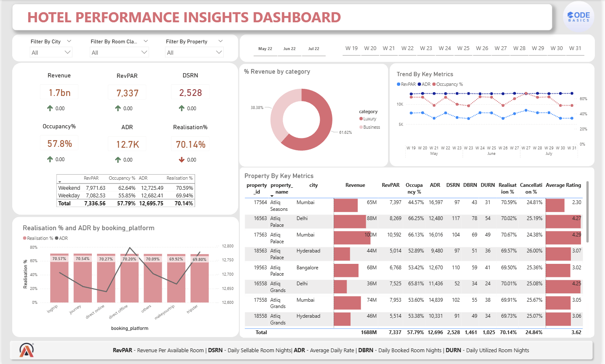

# Hospitality Revenue Insights Dashboard
This project is a Power BI dashboard analyzing hotel performance metrics including revenue, occupancy, RevPAR, ADR, and booking platform performance.

## Dashboard Preview

## Key Metrics Analyzed
- Revenue
- RevPAR (Revenue per Available Room)
- ADR (Average Daily Rate)
- Occupancy %
- Realisation %
- DSRN (Daily Sellable Room Nights)

## Insights Provided
- Revenue trends across weeks
- Revenue distribution by room category
- Property performance comparison
- Booking platform performance
- Key hospitality KPIs analysis

# Hospitality Revenue Insights Dashboard

🎥 **Project Presentation Video:**  
[Watch on YouTube]([https://your-youtube-link-here](https://youtu.be/XBJzUpY7wBc?si=BZIAsQQky8inBul5))

This project is a Power BI dashboard analyzing hotel performance metrics including revenue, occupancy, RevPAR, ADR, and booking platform performance.

## Tools Used
- Power BI
- DAX
- Data Modeling
